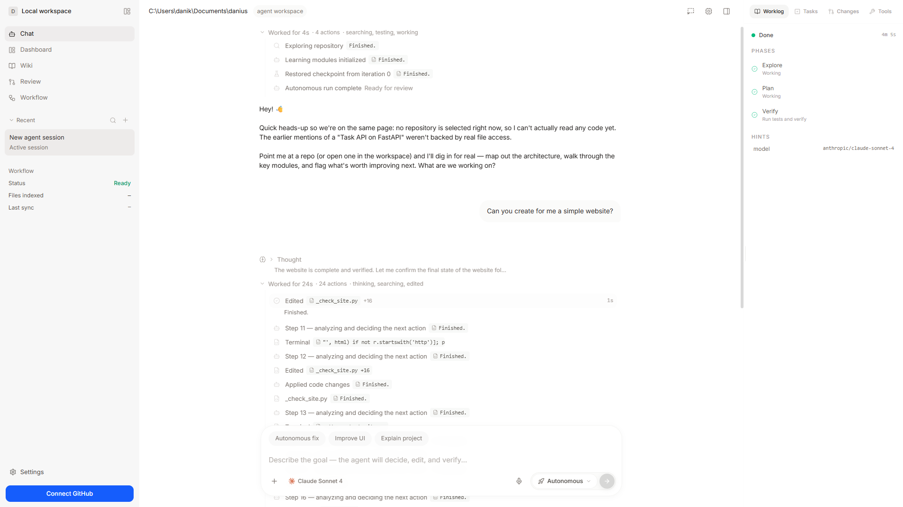

<div align="center">

# Sharrowkin

### The coding agent that remembers your project across sessions.

*Local-first. Bring your own model. Your code never leaves your machine.*

[](LICENSE)
[](https://www.python.org/downloads/)
[](https://nextjs.org/)
[](https://fastapi.tiangolo.com/)

[Install](#install-desktop) · [Quickstart](#getting-started) · [How it works](#the-5-phase-reasoning-cycle) · [Memory](#memory-systems) · [Configuration](#configuration)

</div>

---

<div align="center">



</div>

## Overview

Most coding assistants forget everything the moment you close the tab. Sharrowkin doesn't.

It's a **local-first** AI development agent that reads your codebase, reasons about changes, and applies them through a disciplined multi-phase loop. Across sessions it remembers what it has seen and done through **four complementary memory systems**, so it gets more useful to *your* project over time instead of starting cold every conversation.

Everything runs on your machine: a FastAPI backend drives the reasoning loop and talks to your chosen LLM, while a Next.js web UI gives you a live, Devin-style view of the agent's thinking, file edits, terminal output, and diffs. The only thing that leaves your machine is the LLM call you explicitly configure.

> **Why it's different:** persistent memory + local-first + bring-your-own-model, in one desktop app. Aider is CLI-only, Cursor is cloud and closed — Sharrowkin keeps your code on your machine *and* remembers it.

## Demo

> _Coming soon — a 30-second clip of the agent picking up a real task and resolving it end-to-end in the live workspace._
>
> Want to see it now? Follow the [Quickstart](#getting-started) and open `http://localhost:3000`.

## Install (desktop)

The easiest way to run Sharrowkin is the desktop app. It bundles the Python backend as a sidecar, so there's no Python or Node setup.

1. Download the latest installer from the [Releases](https://github.com/narelabs/sharrowkin/releases) page:
   - **Windows**: `Sharrowkin Agent_0.1.2_x64-setup.exe` (NSIS) or `Sharrowkin Agent_0.1.2_x64_en-US.msi`
2. Run the installer and launch **Sharrowkin Agent**.
3. Add an LLM API key in **Settings**, choose a workspace folder, and start a session.

> Building the desktop app yourself? See [Building the desktop app](#building-the-desktop-app).

## Key Features

- **5-phase reasoning cycle** — every task flows through Observe → Recall → Reason → Stabilize → Commit, giving the agent structure instead of one-shot guessing.
- **Persistent memory** — four memory systems (DSM, RLD, MemoryField, TraceMemory) let the agent recall context, successful plans, and prior traces across sessions. Conversation history is persisted to disk per session, so the agent remembers your dialog even after a restart.
- **Live agent workspace** — watch files open, code stream in, commands run, and diffs render in real time, Devin-style.
- **Built-in preview browser** — when the agent starts a dev server, its URL is detected automatically and rendered in an embedded Preview tab. Sites are shown at desktop width and scaled to fit, so responsive layouts look right.
- **Point-and-fix** — select any region of the live preview and send a note straight to the agent ("fix this spacing", "this button is off").
- **Clone a site** — paste a URL and the agent recreates it in your workspace — the whole site, or just the part you like.
- **Bring your own model** — works with Gemini, Anthropic, OpenAI, or OpenRouter. Configure keys via `.env` or the settings UI.
- **GitHub integration** — connect a repo via OAuth and let the agent work against real projects.
- **Native desktop app** — ships as a Tauri desktop build with a custom window frame; the Python backend is bundled as a sidecar, so end users don't need Python installed.
- **Local and private** — your code never leaves your machine except for the LLM calls you configure.

## Architecture

```
┌─────────────────┐         WebSocket          ┌──────────────────────┐
│   Next.js UI    │ ◄────── live events ──────► │   FastAPI Backend    │
│  (ui/, port     │         REST /api/*         │   (main.py, :8000)   │
│   3000)         │                             │                      │
└─────────────────┘                             │  ┌────────────────┐  │
                                                │  │  Agent Core    │  │
                                                │  │  5-phase loop  │  │
                                                │  └───────┬────────┘  │
                                                │          │           │
                                                │  ┌───────▼────────┐  │
                                                │  │ Memory Systems │  │
                                                │  │ DSM · RLD ·    │  │
                                                │  │ Field · Trace  │  │
                                                │  └───────┬────────┘  │
                                                │          │           │
                                                │  ┌───────▼────────┐  │
                                                │  │   LLM Client   │──┼──► Gemini / Claude /
                                                │  │                │  │    OpenAI / OpenRouter
                                                │  └────────────────┘  │
                                                └──────────────────────┘
```

### The 5-phase reasoning cycle

| Phase | What happens |
|-------|--------------|
| **Observe** | Scans the workspace and analyzes relevant code (cached for speed). |
| **Recall** | Queries all four memory systems for relevant prior context. |
| **Reason** | Generates a solution via the configured LLM. |
| **Stabilize** | Validates the proposed changes and checks for repeated errors. |
| **Commit** | Applies the patch, runs verification, and updates memory. |

### Memory systems

- **DSM (Dynamic Segmented Memory)** — hierarchical category routing + semantic vector search (Qdrant) + an associative graph between memory nodes.
- **RLD** — stores patterns from successful plans so the agent reuses what works.
- **MemoryField** — Hebbian-style associative reinforcement between concepts.
- **TraceMemory** — records execution traces for replay and learning.

## Project Structure

```
sharrowkin/
├── main.py            # FastAPI entrypoint
├── agent/             # Core reasoning loop and phases
├── api/               # REST + WebSocket routers
├── core/              # Tools, LLM client, workspace utilities
├── memory/            # DSM, RLD, MemoryField, TraceMemory
├── planning/          # Hierarchical planner, task graph
├── cognition/         # Reasoning support modules
├── debugging/         # Error analysis
├── integrations/      # External integrations (GitHub, etc.)
├── config/            # Settings
├── tests/             # Test suite
└── ui/                # Next.js frontend
```

## Getting Started

### Prerequisites

- **Python** 3.10 or newer
- **Node.js** 18 or newer
- An API key for at least one LLM provider (Gemini, Anthropic, OpenAI, or OpenRouter)

### 1. Backend setup

```bash
# Clone the repository
git clone https://github.com/narelabs/sharrowkin.git
cd sharrowkin

# Create a virtual environment
python -m venv venv
source venv/bin/activate        # Windows: venv\Scripts\activate

# Install dependencies
pip install -r requirements.txt

# Configure environment
cp .env.example .env
# Edit .env and add your LLM API key(s)
```

### 2. Frontend setup

```bash
cd ui
npm install
```

### 3. Run

Start the backend (from the repo root):

```bash
python main.py
# API runs at http://127.0.0.1:8000  (docs at /docs)
```

In a second terminal, start the frontend:

```bash
cd ui
npm run dev
# UI runs at http://localhost:3000
```

Open [http://localhost:3000](http://localhost:3000) and start a session.

## Building the desktop app

The desktop app is a [Tauri](https://tauri.app/) shell that bundles the Next.js UI and a PyInstaller-built backend sidecar.

```bash
# 1. Build the backend sidecar (from repo root)
pyinstaller --noconfirm --clean sharrowkin-backend.spec
#    Produces dist/sharrowkin-backend.exe

# 2. Copy it into the Tauri sidecar location with the target-triple name
#    Windows x64 example:
cp dist/sharrowkin-backend.exe \
   ui/src-tauri/binaries/sharrowkin-backend-x86_64-pc-windows-msvc.exe

# 3. Build the installer (runs `next build`, then bundles)
cd ui && npm run tauri:build
```

Installers are written to `ui/src-tauri/target/release/bundle/` (`.msi` and `.exe` on Windows). The app version is set in `ui/src-tauri/tauri.conf.json`, `ui/src-tauri/Cargo.toml`, and `ui/package.json` — keep them in sync.

## Configuration

All configuration lives in `.env` (copy from `.env.example`):

| Variable | Description |
|----------|-------------|
| `GEMINI_API_KEY` | Google Gemini API key |
| `ANTHROPIC_API_KEY` | Anthropic (Claude) API key |
| `OPENAI_API_KEY` | OpenAI API key |
| `OPENROUTER_API_KEY` | OpenRouter API key |
| `GITHUB_CLIENT_ID` | GitHub OAuth app client ID (optional) |
| `GITHUB_CLIENT_SECRET` | GitHub OAuth app client secret (optional) |
| `GITHUB_REDIRECT_URI` | OAuth callback URL |
| `WORKSPACE_PATH` | Default workspace directory for the agent |

API keys can also be set at runtime through the settings UI.

## Development

```bash
# Run the test suite
pytest

# Run with coverage
pytest --cov

# Lint (backend)
ruff check .

# Lint (frontend)
cd ui && npm run lint
```

## Contributing

Contributions are welcome. Please open an issue to discuss substantial changes before submitting a pull request, and make sure the test suite passes.

## License

Licensed under the [Apache License 2.0](LICENSE).

---

<div align="center">
Built by <a href="https://github.com/narelabs">NARE Labs</a>
</div>
