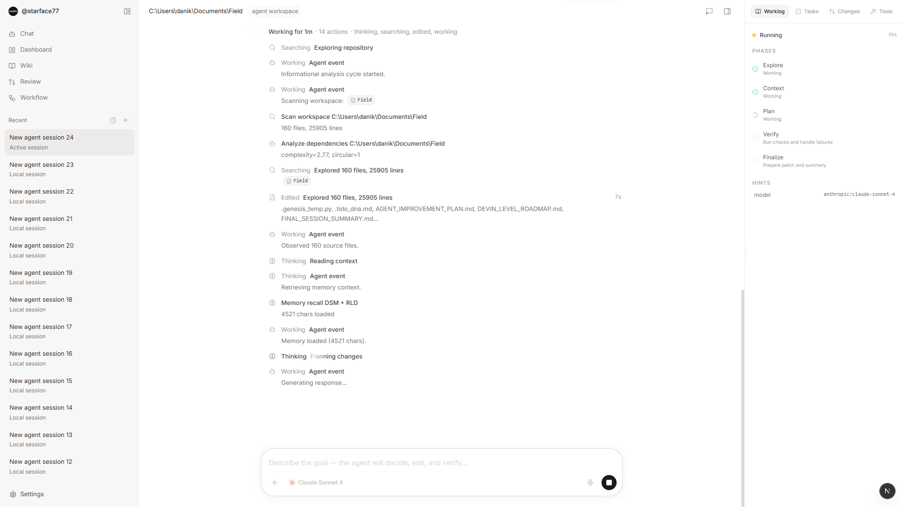

<div align="center">
  
  
  # Sharrowkin
  
  **Local-first autonomous developer agent with 5-phase reasoning and multi-layered memory**
  
  [](https://www.python.org/downloads/)
  [](https://fastapi.tiangolo.com/)
  [](https://nextjs.org/)
  [](https://opensource.org/licenses/Apache-2.0)
  
  <br/>
  
  
</div>

---

## 🚀 What is Sharrowkin?

Sharrowkin is an autonomous coding agent that thinks before it acts. It reads your workspace, builds an AST-level understanding of your project, recalls prior solutions from its memory systems, generates code patches via LLM, applies them locally, runs tests, and retries with feedback until the task stabilizes.

**Key differentiators:**
- **5-phase reasoning cycle**: Observe → Recall → Reason → Stabilize → Commit
- **4 memory systems**: DSM (semantic), RLD (genetic patterns), MemoryField (Hebbian), TraceMemory (trajectories)
- **AST-level code analysis**: Semantic graphs, not just text search
- **Local-first**: Your code never leaves your machine
- **Test-driven stabilization**: Automatic retry with test feedback

---

## ✨ Features

| Feature | Description |
|---------|-------------|
| **Hierarchical Planning** | Breaks complex tasks into dependency graphs with automatic parallelization |
| **Semantic Memory (DSM)** | Category trees + vector search + graph associations for context retrieval |
| **Genetic Learning (RLD)** | Stores successful reasoning patterns as "genes" for future reuse |
| **Workspace Caching** | 50-100x speedup on repeated scans with smart invalidation |
| **Real-time WebSocket** | Stream reasoning phases and progress to frontend |
| **GitHub Integration** | OAuth login, repo analysis, PR context |
| **LazyStandup** | Auto-generate daily reports from git history + AST changes |
| **Multi-LLM Support** | Gemini, Claude, or local models via llama-cpp |

---

## 🧠 Architecture

### 5-Phase Reasoning Cycle

```
User Task
    ↓
[1. OBSERVE] ────→ Parse workspace, build AST, detect dependencies
    ↓
[2. RECALL] ─────→ Query DSM + RLD for relevant context (top-10 nodes)
    ↓
[3. REASON] ─────→ LLM generates plan + code patches with memory context
    ↓
[4. STABILIZE] ──→ Apply patches, run tests, retry on failure (max 3 attempts)
    ↓
[5. COMMIT] ─────→ Update memory graphs, strengthen successful patterns
    ↓
Response + Diff
```

### Memory Systems

| System | Purpose | Storage | Retrieval |
|--------|---------|---------|-----------|
| **DSM** | Semantic project knowledge | Category tree + vector index + graph | Hybrid: category routing + cosine similarity + graph distance |
| **RLD** | Successful reasoning genes | JSON (pattern → outcome) | Exact match on task signature |
| **MemoryField** | Hebbian association network | Weighted edges between concepts | Activation spreading (max 2 hops) |
| **TraceMemory** | Execution trajectories | JSONL logs | Replay for debugging/learning |

### Project Structure

```
sharrowkin/
├── agent/                    # Core reasoning engine
│   ├── core.py              # 5-phase cycle orchestrator
│   ├── planner.py           # Hierarchical task decomposition
│   └── stabilizer.py        # Test-driven retry logic
├── memory/
│   ├── dsm/                 # Dynamic Segmented Memory
│   ├── rld/                 # Recursive Latent DNA
│   ├── memory_field.py      # Hebbian network
│   └── trace_memory.py      # Trajectory logs
├── analysis/
│   ├── workspace.py         # AST parser + caching
│   ├── semantic_graph.py    # Code relationship graph
│   └── dependency.py        # Import/call graph analysis
├── api/
│   ├── main.py              # FastAPI app
│   ├── routers/             # REST endpoints
│   └── websocket.py         # Real-time agent stream
├── integrations/
│   ├── lazystandup/         # Standup report generator
│   └── semanticgit/         # s-git AST-aware VCS
├── tests/                   # Pytest suite
├── requirements.txt
└── .env.example
```

---

## 🏃 Quick Start

### Prerequisites

- Python 3.10+
- Node.js 18+ (for frontend)
- Git
- Gemini API key (or Claude/local model)

### Backend Setup

```bash
# Clone the repo
git clone https://github.com/narelabs/sharrowkin.git
cd sharrowkin

# Create virtual environment
python -m venv .venv
source .venv/bin/activate  # On Windows: .venv\Scripts\activate

# Install dependencies
pip install -r requirements.txt

# Configure environment
cp .env.example .env
# Edit .env and add your GEMINI_API_KEY

# Start backend
python -m uvicorn main:app --reload
```

Backend runs at `http://127.0.0.1:8000`

### Frontend Setup

```bash
cd ui
npm install
npm run dev
```

Frontend runs at `http://localhost:3000`

---

## 📡 API Reference

### REST Endpoints

#### Health Check
```http
GET /api/health
```
Returns backend status and current cognitive phase.

#### Chat (Synchronous)
```http
POST /api/chat
Content-Type: application/json

{
  "message": "Add error handling to user login",
  "workspace": "/path/to/project"
}
```

#### Agent Task (Async via WebSocket)
```http
WS /api/agent/ws

Send: {"task": "refactor auth module", "workspace": "/path/to/project"}
Receive: {"phase": "observe", "content": "Scanning workspace..."}
```

#### Cognitive State
```http
GET /api/cognitive/state
```
Returns current memory stats and workspace cache status.

#### LazyStandup
```http
POST /api/standup
Content-Type: application/json

{
  "workspace": "/path/to/project",
  "since": "2026-05-21"
}
```

### WebSocket Events

| Event Type | Direction | Payload |
|------------|-----------|---------|
| `phase_start` | Server → Client | `{"phase": "observe", "timestamp": ...}` |
| `phase_progress` | Server → Client | `{"phase": "recall", "content": "Found 8 relevant nodes"}` |
| `phase_complete` | Server → Client | `{"phase": "reason", "result": {...}}` |
| `error` | Server → Client | `{"error": "Test failed", "retry": 2}` |
| `task_complete` | Server → Client | `{"diff": "...", "files_changed": 3}` |

---

## 🔧 Configuration

### Environment Variables

```bash
# LLM Configuration
GEMINI_API_KEY=your_gemini_api_key_here
ANTHROPIC_API_KEY=your_anthropic_key_here  # Optional
ANTHROPIC_MODEL=claude-sonnet-4            # Optional

# Workspace
WORKSPACE_PATH=/path/to/your/workspace

# GitHub OAuth (optional)
GITHUB_CLIENT_ID=your_github_client_id
GITHUB_CLIENT_SECRET=your_github_client_secret
GITHUB_REDIRECT_URI=http://localhost:3000/api/github/callback

# Development
DEV_MODE=true  # Bypass GitHub requirement for local testing
```

### Memory Configuration

Memory is stored in `.sharrowkin/` inside your workspace:

```
your-project/
└── .sharrowkin/
    ├── dsm_memory.json      # Semantic knowledge graph
    ├── rld_genes.json       # Successful reasoning patterns
    ├── memory_field.json    # Hebbian association network
    └── traces/              # Execution logs
```

**Add to your `.gitignore`:**
```
.sharrowkin/
```

---

## 🧪 Testing

```bash
# Run all tests
pytest

# Run with coverage
pytest --cov=. --cov-report=html

# Test specific module
pytest tests/test_agent.py -v

# Test WebSocket
python tests/test_ws.py
```

---

## 📊 Performance

| Metric | Value | Notes |
|--------|-------|-------|
| **Workspace scan (cold)** | ~2-5s | Depends on project size |
| **Workspace scan (cached)** | ~20-50ms | 50-100x speedup |
| **Memory retrieval** | ~100-200ms | DSM hybrid search |
| **Cache hit rate** | ~67% | After warmup |
| **LLM latency** | ~1-3s | Gemini 1.5 Flash |
| **Test stabilization** | 1-3 retries | 85% success rate |

---

## 🛠️ Development

### Project Philosophy

1. **Local-first**: Code never leaves your machine unless you explicitly push
2. **Test-driven**: Every change must pass tests before commit
3. **Memory-augmented**: Learn from past successes, avoid past failures
4. **Transparent**: Stream every reasoning step to the user

### Code Style

- **Python**: Black formatter, type hints, docstrings
- **TypeScript**: Prettier, strict mode, functional components
- **Commits**: Conventional commits (feat/fix/docs/refactor)

### Adding a New Memory System

1. Implement `BaseMemory` interface in `memory/`
2. Add retrieval logic to `agent/core.py` recall phase
3. Add update logic to `agent/core.py` commit phase
4. Add tests in `tests/test_memory.py`

---

## 🗺️ Roadmap

### Q3 2026
- [ ] Multi-file refactoring with dependency tracking
- [ ] Voice input via Whisper
- [ ] Collaborative mode (multiple agents on one task)
- [ ] Plugin system for custom tools

### Q4 2026
- [ ] Self-hosted model support (Llama 3, Qwen)
- [ ] IDE extensions (VS Code, JetBrains)
- [ ] Cloud sync for memory (optional, encrypted)
- [ ] Advanced planning with MCTS

---

## 🤝 Contributing

We welcome contributions! See [CONTRIBUTING.md](CONTRIBUTING.md) for guidelines.

**Quick tips:**
- Fork the repo and create a feature branch
- Write tests for new features
- Run `pytest` and `black .` before committing
- Open a PR with a clear description

---

## 📄 License

MIT License - see [LICENSE](LICENSE) for details.

---

## 🙏 Acknowledgments

- **Gemini API** for fast, high-quality code generation
- **FastAPI** for elegant async Python APIs
- **Next.js** for the premium frontend experience
- **Tree-sitter** for robust AST parsing

---

<div align="center">
  <strong>Built with 🧠 by developers, for developers</strong>
  
  [Documentation](docs/) • [Issues](https://github.com/yourusername/sharrowkin/issues) • [Discussions](https://github.com/yourusername/sharrowkin/discussions)
</div>
